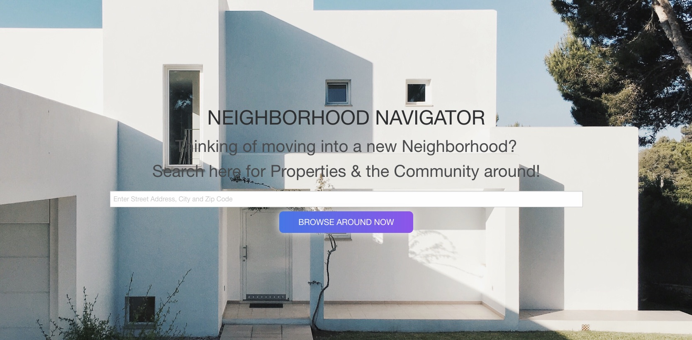

# House-Hunters

## Description

Link to deployed application
https://neilmkflyingk.github.io/house-hunters

Github link
https://github.com/neilmkflyingk/house-hunters

This house-hunters app was created as a bootcamp student project group challenge. This app is a javascript property information finder. 
By using geocoding, user can convert an address into geographic coordinates (latitude and longitude) that can be used to locate a place on a map. USer can then use the coordinates to display the data around that location such as nearby property information. The location will then be stored in the local storage for future reference.
The code of this app was created from scratch. 

House-hunters application uses two APIs to get search result : 

1. Geocode API (https://geocode.maps.co/). Using this API, application receive latitude and longitude from the address user typed. 

2. Attom API (https://api.developer.attomdata.com/docs). 

## Table of Contents

- [Installation](#installation)
- [Usage](#usage)
- [Requirements](#requirements)
- [Credits](#credits)
- [License](#license)

## Future features

1. School district information
2. Traffic assesment
3. Crime rates
4. Sales History
5. Entertainment
6. Restaurants

## Installation

N/A

## Requirements

No special requirements

## Usage

1. Fill in the address & press search button
2. Search results will appear
3. If no address entered, user will see alert message 
4. if nothing is found according to the search criteria - user will see the warning message

Screenshot located in `assets/images` folder

## Credits

Geocode API https://geocode.maps.co/

Attom API https://attomdata.com/

Foundation CSS framework https://get.foundation/

Icons https://icons8.com/

Attom API (https://api.developer.attomdata.com/docs)

Image background was taken from Unsplash website. Credits : https://unsplash.com/photos/4ojhpgKpS68

## License

Please refer to the LICENSE in the repo.
